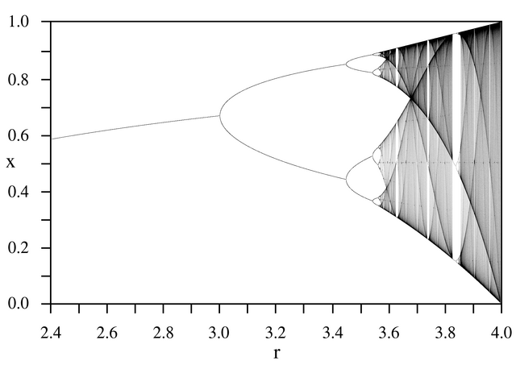

# Bifurcation-Diagram
 ## What is bifurcation diagram?

A bifurcation diagram is a visual representation used in mathematics and nonlinear dynamics, particularly in the study of dynamical systems. It displays the long-term behavior of a system as a parameter is varied. Bifurcation diagrams are particularly useful in understanding how a system transitions between different states or behaviors as a control parameter changes.

Here are the key characteristics and components of a bifurcation diagram:

**Parameter Variation**: The x-axis of the bifurcation diagram represents a specific parameter (often denoted as "r" or "λ") that is being systematically varied. This parameter is typically associated with a dynamical system's equations.

**System Behavior**: The y-axis represents the long-term behavior of the system under investigation. This behavior is often depicted as a state variable, such as the position of a particle, the population size of a species, or any other relevant quantity.

**Points and Lines**: Each point or vertical line on the diagram corresponds to a specific state or behavior of the system as the parameter varies. Points represent fixed points or periodic orbits, while lines represent regions of parameter values where the system exhibits chaotic behavior or undergoes bifurcations (sudden qualitative changes in behavior).

**Bifurcation Points**: Bifurcation points on the diagram indicate where the system transitions from one type of behavior to another. Common types of bifurcations include period-doubling bifurcations, saddle-node bifurcations, and pitchfork bifurcations.

**Complex Dynamics**: Bifurcation diagrams often reveal complex and intricate patterns, especially in systems with nonlinear behavior. These patterns can include the emergence of periodic oscillations, chaotic regions, and regions of stability.

**Feigenbaum Constants**: In some bifurcation diagrams, a universal scaling law known as the Feigenbaum constants may emerge. These constants describe the convergence of bifurcation points as the parameter is iteratively refined.

Bifurcation diagrams are valuable tools for understanding the behavior of dynamic systems across a range of scientific disciplines, including physics, biology, engineering, and economics. They help researchers identify critical parameter values where qualitative changes in the system's behavior occur, which is essential for gaining insights into the underlying dynamics of complex systems.

Following is a typical image of a bifurcation diagram of a logistic map.

